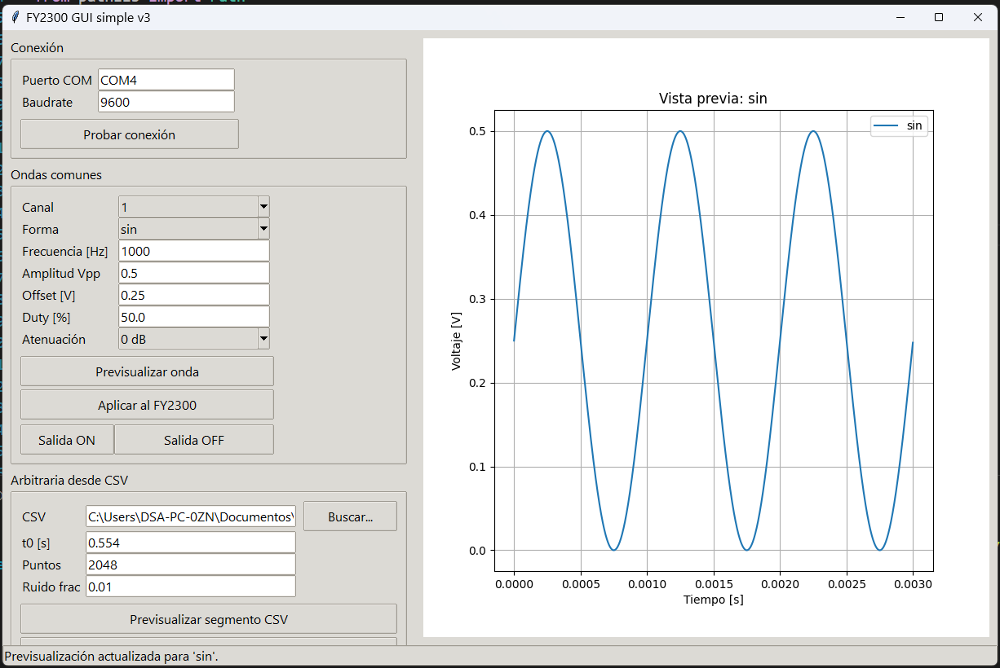
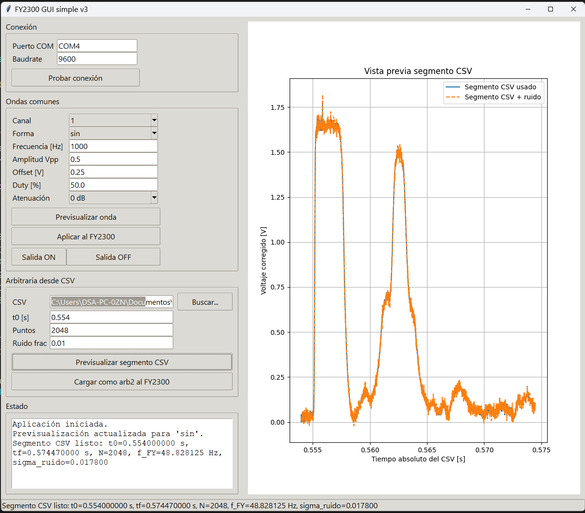
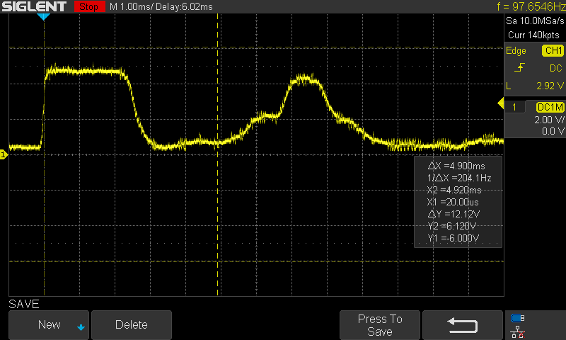

# FeelTech FY2300 20M Arbitrary Waveform Tools

Python tools for working with the **FeelTech FY2300 20M** function / arbitrary waveform generator.

This repository currently includes three main components:

1. **`fy2300_serial.py`**  
   A Python serial library for controlling the FY2300 through ASCII commands validated with real hardware.

2. **`fy2300_gui_simple_v3.py`**  
   A simple Tkinter GUI that lets users:
   - configure common waveforms,
   - adjust frequency, amplitude, offset, and duty cycle,
   - select 0 dB / 20 dB attenuation,
   - load an arbitrary waveform from an oscilloscope CSV file,
   - upload it to the FY2300 using `arb2`.

3. **`EMISION_SintReal_fy2300_RUIDO.py`**  
   A functional example that takes a real segment from `SDS00004.csv`, adds controlled white noise, and uploads it as an arbitrary waveform.

---

## Motivation

When working with existing FeelTech-related repositories, we found that arbitrary waveform data upload did not correctly solve our specific use case for the **FY2300 20M**, especially when trying to reproduce a real waveform measured with an oscilloscope.

For that reason, this project was built around a workflow that was actually validated in the lab:

- arbitrary waveform upload through `upload_waveform(...)`,
- playback through `arb2`,
- frequency, amplitude, offset, duty, attenuation, and trigger control from Python,
- and a simple GUI so that other users can reuse the tool without editing the scripts directly.

---

## Included files

- `fy2300_serial.py`
- `fy2300_gui_simple_v3.py`
- `EMISION_SintReal_fy2300_RUIDO.py`
- `DISCLAIMER.md`

---

## Requirements

- Python 3.10+
- `numpy`
- `matplotlib`
- `pyserial`

Installation:

```bash
pip install -r requirements.txt
```

---

## Quick start

### 1) GUI

```bash
python fy2300_gui_simple_v3.py
```

The GUI allows you to:

- test COM port communication,
- configure a common waveform on the main channel (CH1),
- load a signal segment from a compatible CSV file,
- upload it as `arb2`,
- preview the waveform locally before sending it to the instrument.

### 2) Real waveform example

```bash
python EMISION_SintReal_fy2300_RUIDO.py
```

This script:

- reads `SDS00004.csv`,
- extracts a time segment,
- adapts it to 2048 points,
- adds mild white noise,
- uploads it as an arbitrary waveform to the FY2300.

---

## Screenshots

### Main GUI


### CSV segment preview


### Instrument / output example


---

## Important notes

- The current implementation is focused on the **main channel (CH1)**.
- Instrument attenuation directly affects the observed output amplitude.  
  Always verify whether the generator is set to **0 dB** or **20 dB**.
- The library was built for a specific workflow validated with real hardware, not as a universal wrapper for every FeelTech model.
- Before using this software with laboratory equipment, read **`DISCLAIMER.md`**.

---

## Suggested future improvements

- formal CH2 support,
- GUI presets,
- reading current instrument parameters,
- packaging as an installable Python module,
- automated tests with bench hardware.

---

## License

This project is released under the MIT License.

The MIT License already includes an "as is" / no warranty clause. In addition, this repository provides an explicit operational disclaimer in **`DISCLAIMER.md`** for hardware, lab, and equipment use.
